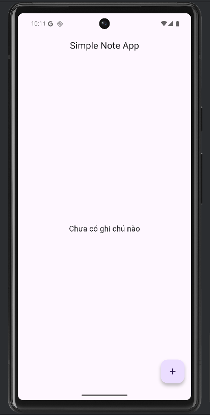
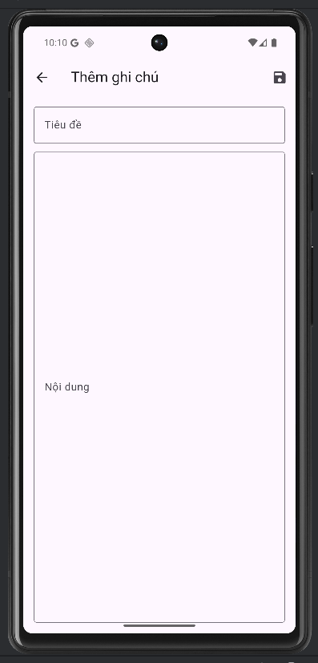
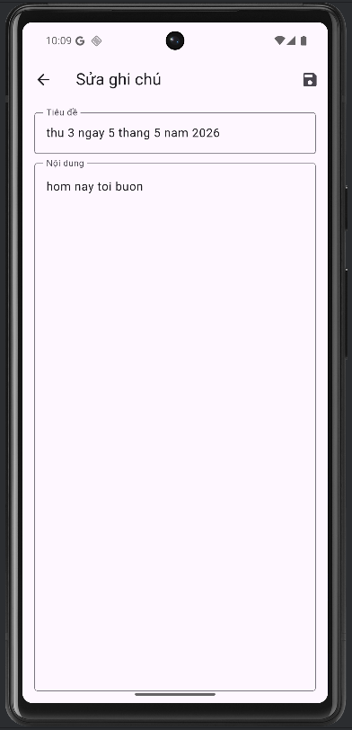
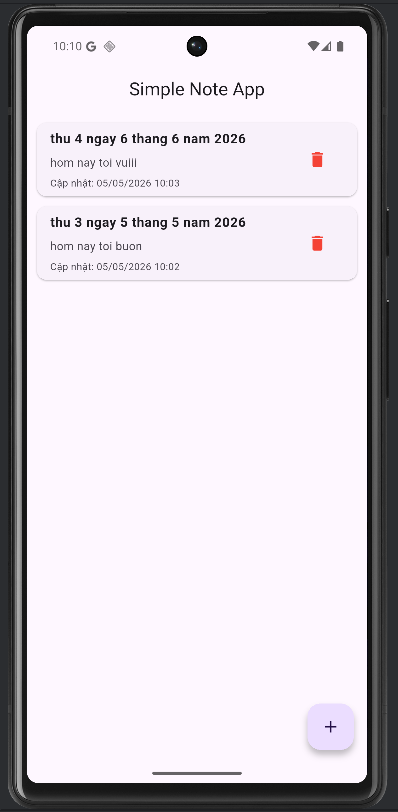

# Simple Note App (Flutter)

Ứng dụng ghi chú đơn giản được xây dựng bằng Flutter.

---

## Chức năng chính

- Thêm ghi chú (Title + Content)
- Hiển thị danh sách ghi chú
- Sửa ghi chú
- Xóa ghi chú (có xác nhận)
- Lưu dữ liệu cục bộ bằng SQLite (Sqflite)
- Hiển thị thời gian cập nhật

---

## Công nghệ sử dụng

- Flutter
- Sqflite (SQLite local database)
- Provider (State Management)
- path_provider
- intl

---

## Demo ứng dụng

### Màn hình chính

### Thêm ghi chú

### Nhập nội dung

### Danh sách ghi chú

---

